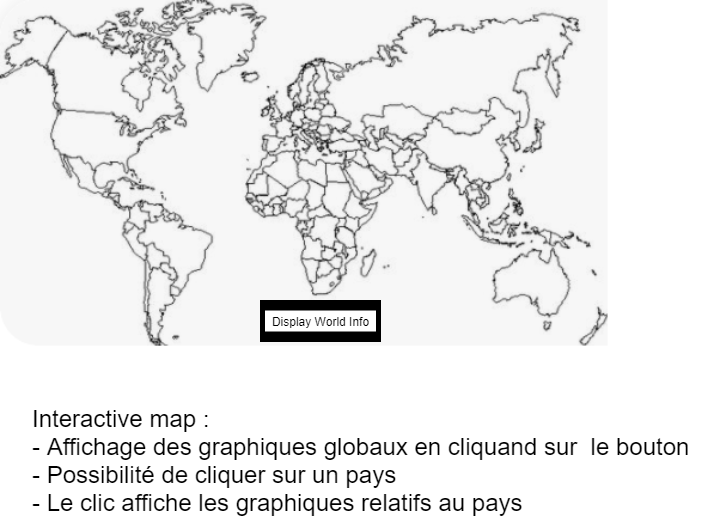
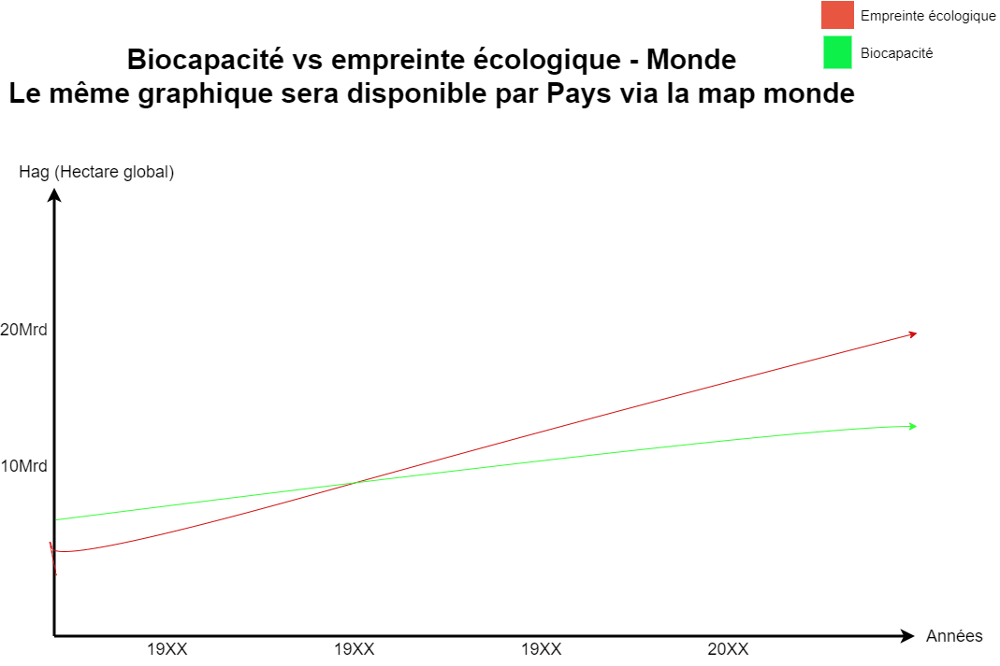
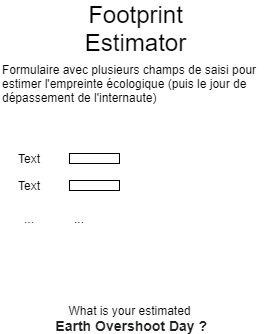
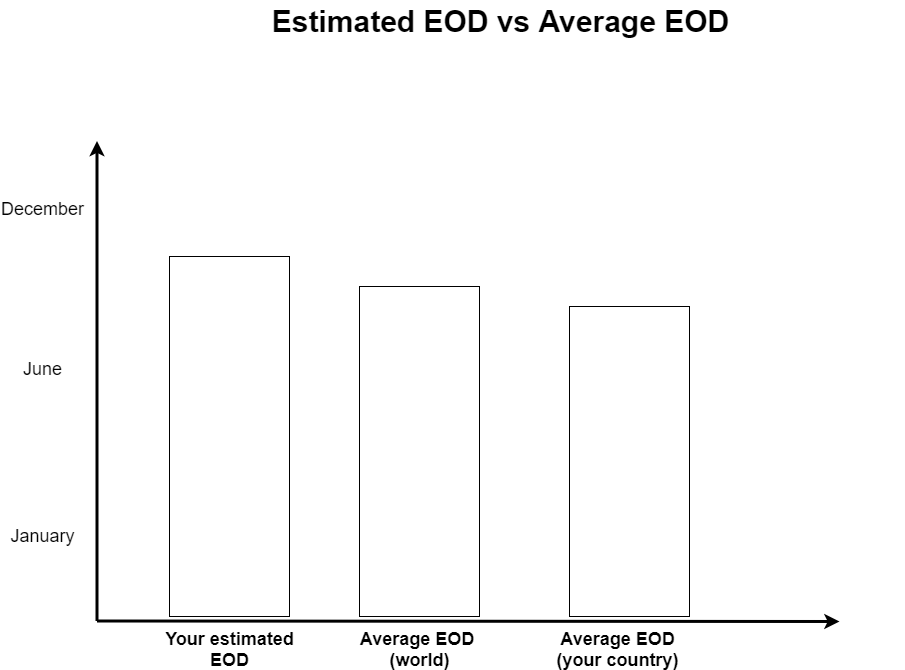
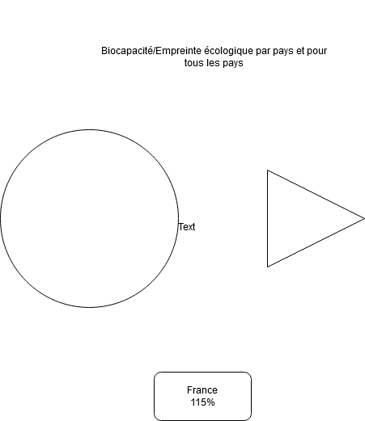

Emna Barred, Najib El Khadir, Antoine Poloce et Nabil Lamrabet.

Visualisation interactive de données, université Lyon 1, Master 2 Intelligence Artificielle, 2020-2021

# Document de cadrage : Quel est le rapport entre l'évolution de notre empreinte écologique et la biocapacité à l'échelle mondiale ? 

La biocapacité d'une zone biologique représente sa capacité à produire une offre continue en ressources renouvelables et à absorber les déchets découlant de leur consommation, notamment le dioxyde de carbone.

Dans ce rapport nous notons "empreinte écologique/biocapacité", cela ne signifie pas "empreinte écologique et ou biocapacité" mais plutôt "empreinte écologique sur biocapacité" (il faut le voir comme une unité de mesure).

## Problème abordé

Le réchauffement climatique et la dégradation de notre planète représentent un enjeu important pour la survie de notre/nos espèce(s) et plus particulièrement pour certaines populations vivant dans des milieux à risque (sécheresse, catastrophes naturelles). Ils s'agit également, pour de nombreuses autres raisons, de problèmes qu'on souhaite endiguer le mieux possible.

Nous savons que la réduction de ces phénomènes nécessite le changement des habitudes de consommation des habitants. Pourtant, tous les habitants n'ont pas les mêmes habitudes de consommation et ne disposent pas des mêmes ressources. 

Néanmoins nous pouvons regrouper les habitants par zone géographique. Grossièrement et à l'échelle mondiale nous pouvons admettre qu'un pays représente un cluster d'habitants consommant de la même façon et vivant sous les mêmes lois.

Il est intéressant d'utiliser les pays comme cluster car ils disposent de propriétés pouvant s'appliquer à tous leurs habitants (exemple : appliquer des lois à tous les habitants du cluster ou effectuer d'autres actions ayant un impact pour tous les habitants). D'autres organisations ont également les mêmes propriétés (unions économiques/politiques).

On souhaite donc disposer d'un visualisation interactive permettant de *profiler* les pays pour savoir sur lesquels il est utile de concentrer nos efforts.

## Public visé & tâches pouvant être effectués

Plusieurs types de publics différents sont visés.

- Dans un premier temps nous visons une entité/groupe politique qui soit capable de prendre une décision sur un ou plusieurs pays (par exemple un gouvernement ou un dirigeant d'un pays).

L'objectif de notre visualisation interactive est donc de faire prendre conscience à ce gouvernement de son empreinte écologique par rapport à sa biocapacité, de son évolution dans le temps et de se comparer à d'autres pays sur ces critères.

- On vise également les organisations qui militent et agissent dans le monde pour réduire l'impact écologique de la population mondiale sur la planète (par exemple une ONG internationale).

Notre visualisation interactive doit permettre à ces organisations de connaître les pays qui ont la plus grand empreinte écologique/biocapacité (pour par exemple axer leur stratégie sur ces pays).

En effet celles-ci disposent de moyens pouvant influencer l'impact écologique d'un pays mais ces moyens sont limités. Elles doivent pouvoir décider sur quels pays allouer ses moyens (investissement, moyens financiers/politiques, etc.). Elle doit pouvoir répondre aux questions suivante :

- Quels sont les pays qui ont la plus/moins grosse empreinte écologique/biocapacité ?
- Quel pays progresse et lequel régresse ?
- Est-il pertinent d'appliquer nos moyens à tous les pays ? Cette question nécessite de prendre en compte les deux premières. Du point de vue de l'ONG, est-ce qu'il est nécessaire d'affecter des moyens dans un pays qui a une grosse empreinte écologique/biocapacité mais qui fait d'importants progrès ?

Voici un exemple pour la prise de décision d'une ONG :

Notre planète comporte deux pays, le pays A et le pays B.
Le pays A comporte 1 000 habitants.
Le pays B comporte 60 000 000 habitants.

Nous avons besoin de connaître l'impacte des deux pays.
On répondra différemment aux questions précédemment posées si l'impacte du pays A est dix fois plus important que celui du B ou que si l'impact du pays A est négligeable.

- Enfin on cible également tout individu qui souhaite s'informer sur l'empreinte écologique de son pays. Notre visualisation peut lui permettre d'estimer si l'individu moyen de son pays a une empreinte écologique/biocapacité bonne ou trop importante. Néanmoins on ne lui fournira pas un moyen de situer son empreinte écologique par rapport à l'individu moyen de son pays.

## Limites de la visualisation

Une première limite réside dans la mesure utilisée, celle-ci ne prend pas en compte la délocalisation de la pollution. Il y a débat pour savoir si celle-ci doit être prise en compte et dans quelles proportions.

## Jeux de données

- [NFA 2019 public_data.csv](https://github.com/nalmt/dataviz/blob/main/datasets/NFA%202019%20public_data.csv).
Ce dataset comporte les données pour calculer la biocapacité d'un pays (cropland, grazing land,forest land,fishing ground,built up land) et l'impact carbone du pays, et ce pour chaque entre 1960 et 2016 (les données disponibles changent en fonction des pays).

- [GFN Country Code Concordance Table.csv](https://github.com/nalmt/dataviz/blob/main/datasets/GFN%20Country%20Code%20Concordance%20Table.csv
-nabil-1.pdf).
On souhaite fusionner les codes internationaux de chaque pays du second dataset pour les ajouter au premier.

## Projets liés 

- [Global Footprint Network : Earth Overshoot Day](https://www.footprintnetwork.org/our-work/earth-overshoot-day/)

Nous utilisons la métrique créé par cette organisation : le jour de dépassement. Il s'agit d'une métrique mieux comprise qu'un rapport en pourcentage et donc plus impactante. 

## Organisation

### Moyens de communication

Nous utilisons un serveur Discord pour organiser nos réunions et communiquer. Pour la communication directe, on utilise les messages privés Discord, les emails, SMS et appels téléphoniques. 
Git & Github nous permettent de travailler collaborativement sur notre code, nos rendus et de suivre l'investissement des membres du projet. Nous travaillons totalement à distance. Chaque personne travaille en autonomie. 

## Allocation horaire du travail

À partir du 10 décembre et jusqu'à la soutenance du mois de Janvier, on alloue 3 heures de travail personnel par personne et 1 heure de réunion chaque semaine. Ces chiffres sont temporaires et serons ajustés après une semaine.

On ne travaille pas exactement de façon agile mais on reprend quelques concepts (on travaille sur des sprints de 1 semaine). 

### Rôles identifiés

- Emna Barred : développement D3, pré-traitement des données.
- Najib El Khadir : développement D3, suivi du projet et documentation.
- Antoine Poloce : pré-traitement des données, design, développement D3.
- Nabil Lamrabet : suivi du projet et documentation, pré-traitement des données, développement D3.

## Scan des esquisses finales

### Comparaison ressources consommé par pays sur ressources "allouées" au pays

[Évolution impact années précedentes (PDF).](https://github.com/nalmt/dataviz/blob/main/assets/esquisses_nabil/esquisse-nabil-1.pdf)

Possibilité d'afficher les années précédentes des pays et les années en prévisions (objectif : voir les pays qui font des efforts après un accord international sur le climat par exemple).

[Dette des pays (PDF).](https://github.com/nalmt/dataviz/blob/main/assets/esquisses_nabil/esquisse-nabil-2-3.pdf)

Première figure : affichage des "dettes" des pays (un pays est en dette s'il a consommé plus de ressources qu'il lui est permis de consommer sur une année).

Deuxième figure : suivi de la consommation d'un pays à une date donnée. On affiche graphiquement la proportion consommée par rapport à la taille du pays.

.png)

